# How it works

A 433 MHz radio link on one Tiny Tapeout tile (sky130). Two demo boards run the same chip: one transmits, the other receives. Each board's antenna is two bare wires, and there are no other external parts.

This page covers the idea, the measurements and models that set the specs, each schematic, and the layout. For test instructions see [info.md](info.md).

## Overview

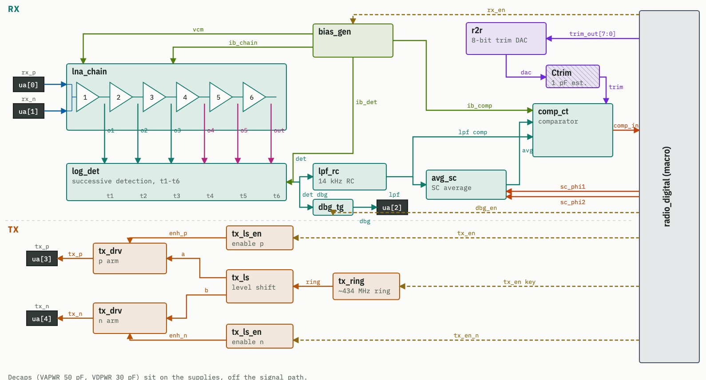

- **RX (top):** the dipole on ua[0]/ua[1] feeds a 6-stage amplifier chain (`lna_chain`). Each stage's output taps into the log detector (`log_det`), which turns RF power into a DC level. That level is filtered (`lpf_rc`) and compared (`comp_ct`) against its own slow average (`avg_sc`), plus a fine trim from the DAC (`r2r`). The comparator bit goes to the digital macro. `bias_gen` supplies every block's currents.
- **TX (bottom):** the digital macro keys the ring oscillator (`tx_ring`). The level shifter (`tx_ls`) turns it into two opposite-phase 3.3 V signals, one driver per dipole arm (`tx_drv`, ua[3]/ua[4]).
- Dashed lines are enables from the digital. This is the "Block diagram" view of the floorplanning tool ([layout/floorplan](../layout/floorplan)).

## Theory of operation

### On-off keying (OOK)
The transmitter switches a 433 MHz carrier on and off, and that is all it does. The receiver doesn't tune to the carrier. It only measures how much RF energy arrives (the *envelope*), so "loud" means 1 and "quiet" means 0.

Because of that, the transmitter needs no crystal or PLL. It is a free-running ring of inverters, and if it lands anywhere in 330–560 MHz the receiver still works. 433 MHz was chosen for its ecosystem: cheap SDRs, `rtl_433`, and garage remotes as test signals.

**dBm** is power on a log scale: 0 dBm = 1 mW, and every −10 dB is 10× less power (−30 dBm = 1 µW). Voltage changes more slowly: −20 dB is 10× less voltage. The transmitter puts out about +4 dBm. At 1 m the receiver sees about −44 dBm, and it can still detect a signal at about −92 dBm. That is 48 dB lower: ~60,000× less power, or ~250× less voltage.

### Finding a signal weaker than the noise
Near the sensitivity limit, "carrier on" moves the detector output by only ~1 mV, and the noise is about as large. A single on/off decision there is barely better than a coin flip. So we don't send single bits:

- Each 7-bit code (DIP switches) selects a **Gold code**: a fixed, noise-like pattern of 127 on/off slots called *chips*. One chip is 104 µs, so one burst is 13.2 ms.
- The receiver makes one 1-bit decision per chip and compares the last 127 decisions with its own code's pattern. The **score** is how many match. Chance gives ~64 out of 127; **≥ 97 counts as a detection** (6σ above chance).
- At −94 dBm the comparator is right only ~75 % of the time, but that is still enough to score ~106.
- The TX sends the burst 3 times. The RX toggles the LED only if 2 of the 3 bursts arrive with the right spacing, then ignores the code for ~1 s. Other codes, remote controls and noise don't toggle it.

### Where the threshold goes
The comparator has to decide "on or off" around a level that changes by tens of dB with distance, inside a window of ~1 mV. It does this with two parts:
- The **slow average** of the detector output. A Gold code is half on and half off, so the average sits in the middle of the signal at any range.
- A **trim servo**. The digital moves an 8-bit DAC up or down one step per sample so that the comparator outputs 1 half of the time. This cancels the comparator's own offset (a few mV, which is more than the signal) in ~0.07 mV steps.

More detail: [slicer.md](slicer.md).

## Testing that set the specs

### Bench measurements (phase 0)
These were measured on an existing chip (ttsky25b) that has a ring oscillator, using wire antennas, a scope and an SDR. Data and scripts are in [`bench/`](../bench).

| What | Result |
|---|---|
| Path loss, 14.5 cm wires, 10 cm–4 m | close to free space (1/d^1.89): **−44 dBm at 1 m** |
| Ring frequency | measured 518 MHz vs 598 MHz simulated, so silicon runs at ×0.866 of simulation |
| Frequency stability | ~0.1 % with temperature, ~1.5 % with supply. Fine for an envelope receiver |
| Keying | on/off in ~30–40 ns, 48 dB on/off ratio |
| Antennas | dipoles beat monopoles by +5 dB and are less sensitive to cables and hands |

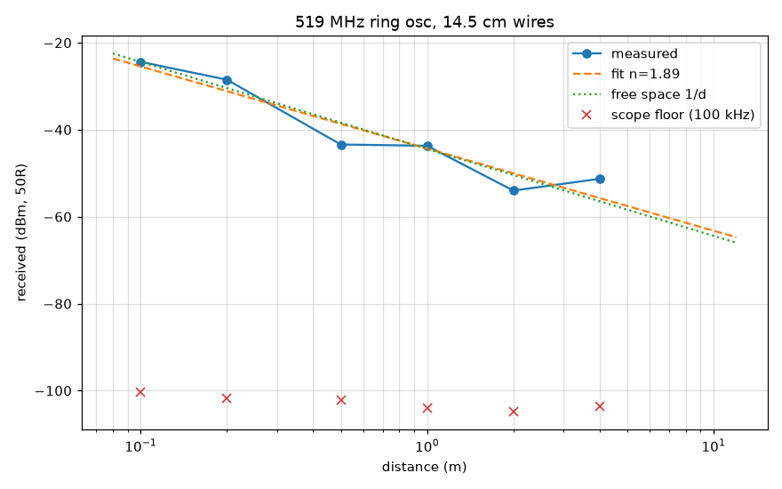

### Models
- `bench/scheme_compare.py` compared three signalling schemes on the same receiver model with noise, fading and a bursty interferer. Gold-127 correlation won in every case, so it is what the chip uses.
  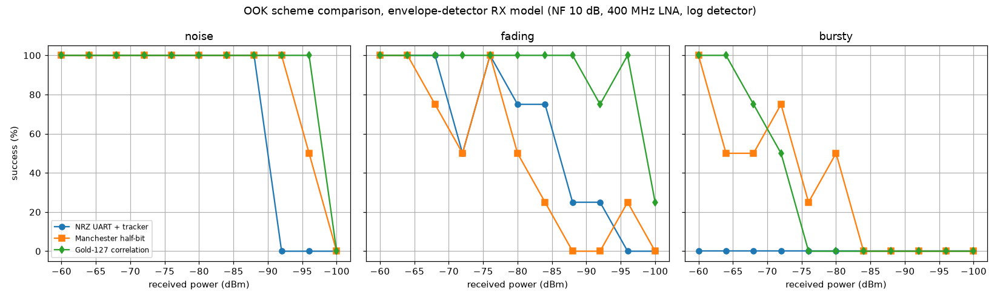
- `model/` holds a bit-exact Python model of the whole link. It is the reference that the RTL is tested against. End to end, every send is detected down to −94 dBm in noise and −90 dBm with ±10 dB fading, and there are zero false toggles.
  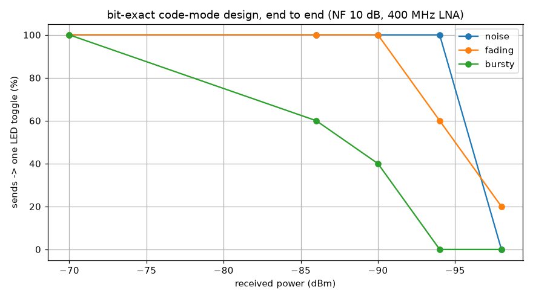

### Resulting specs (simulated, transistor level)

| Spec | Value |
|---|---|
| TX power into the dipole | +3.7 to +3.9 dBm, all process corners |
| TX frequency | ~460 MHz expected on silicon (untrimmed ring; RX accepts 330–560 MHz) |
| RX sensitivity | −94 dBm typical, ≈ −92 dBm worst case |
| RX chain | ~80 dB gain, noise figure ≈ 11 dB |
| Log detector slope | ~13 mV per dB, over ~70 dB |
| Operating temperature | 10–50 °C |
| Clock | 10 MHz from the demo board |

*Corners* are the PDK's fast and slow transistor models. A design that works at all corners and temperatures should work on any chip from the run.

## Schematics

Each link opens the schematic in the online xschem viewer. The block generators are in [`xschem/gen/`](../xschem/gen) and the testbenches in [`sim/`](../sim).

### Top level
- [tt_um_mattvenn_radio](https://xschem-viewer.com/?file=https://github.com/mattvenn/ook-asic-radio/blob/main/xschem/tt_um_mattvenn_radio.sch): the TT tile, with the digital macro, the analog block and the pins.
- [radio_analog](https://xschem-viewer.com/?file=https://github.com/mattvenn/ook-asic-radio/blob/main/xschem/radio_analog.sch): all the analog blocks, the bias and the decoupling capacitors.

### Transmitter
- [tx_top](https://xschem-viewer.com/?file=https://github.com/mattvenn/ook-asic-radio/blob/main/xschem/tx_top.sch): the whole TX chain. There are per-arm enables, so one arm can be driven alone as a fallback (monopole mode).
- [tx_ring](https://xschem-viewer.com/?file=https://github.com/mattvenn/ook-asic-radio/blob/main/xschem/tx_ring.sch): the oscillator, a NAND gate (the on/off enable) plus a ring of standard-cell inverters.
- [tx_ls](https://xschem-viewer.com/?file=https://github.com/mattvenn/ook-asic-radio/blob/main/xschem/tx_ls.sch): the level shifter from 1.8 V to 3.3 V. Its two latch nodes are naturally opposite in phase, which gives the dipole's two arms.
- [tx_drv](https://xschem-viewer.com/?file=https://github.com/mattvenn/ook-asic-radio/blob/main/xschem/tx_drv.sch): thick-oxide buffer tapers into the 3.3 V output drivers, one per arm.

From top to bottom: ring output, the level-shifter latch nodes, the two drivers in antiphase, and the voltage across the dipole.
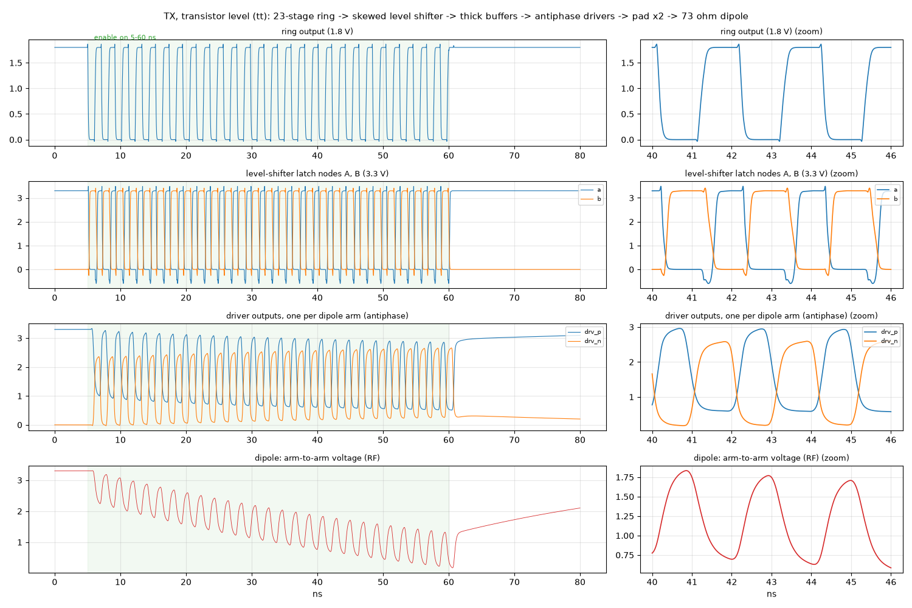

### Receiver: amplifier chain
- [lna_chain](https://xschem-viewer.com/?file=https://github.com/mattvenn/ook-asic-radio/blob/main/xschem/lna_chain.sch): six differential amplifier stages. *Differential* means each stage amplifies the difference between two wires and ignores noise common to both, such as the chip's own 10 MHz clock.
  - [amp_dp](https://xschem-viewer.com/?file=https://github.com/mattvenn/ook-asic-radio/blob/main/xschem/amp_dp.sch): stage 1, the low-noise amplifier (LNA).
  - [amp_dpc](https://xschem-viewer.com/?file=https://github.com/mattvenn/ook-asic-radio/blob/main/xschem/amp_dpc.sch): stages 2–6. Coupling capacitors set the band and stop small DC offsets building up along the chain.

Left: gain to each stage output, peaking around 433 MHz. Middle: rejection of common-mode and supply noise. Right: noise figure.
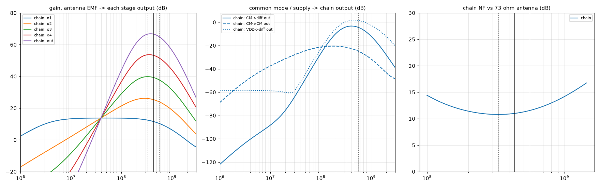

### Receiver: detector, filter, threshold
- [log_det](https://xschem-viewer.com/?file=https://github.com/mattvenn/ook-asic-radio/blob/main/xschem/log_det.sch) / [det_cell](https://xschem-viewer.com/?file=https://github.com/mattvenn/ook-asic-radio/blob/main/xschem/det_cell.sch): the log detector, with one rectifier cell per chain stage. A weak signal is only big enough to register at the last stages; as the signal grows, earlier stages saturate one after another. Summing the cells gives an output that is a straight line in dB, so 70 dB of range fits in ~1 V.
  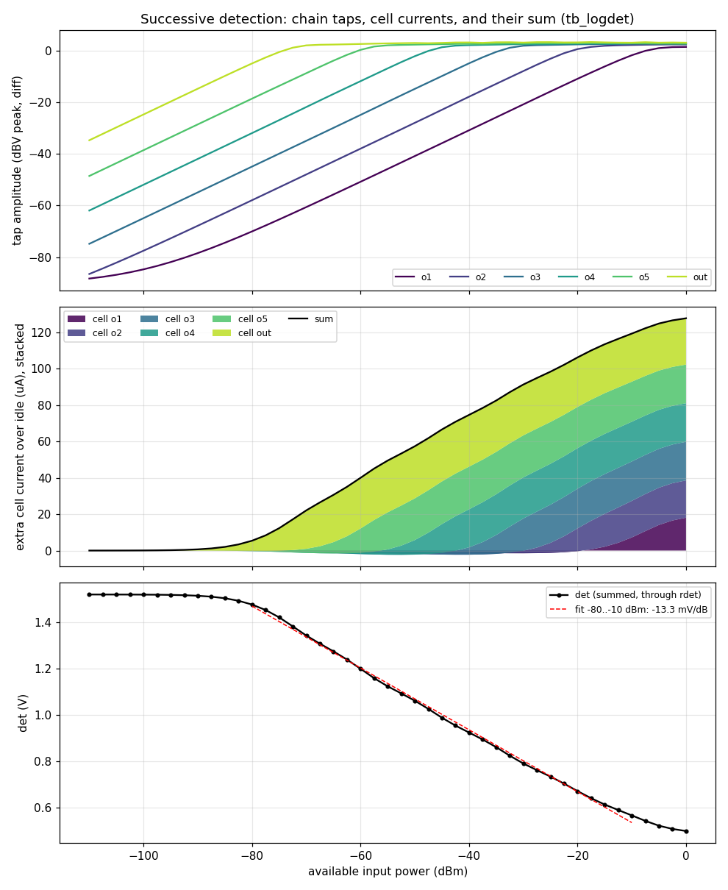
- [lpf_rc](https://xschem-viewer.com/?file=https://github.com/mattvenn/ook-asic-radio/blob/main/xschem/lpf_rc.sch): a 14 kHz RC low-pass filter, which keeps the chip-rate envelope and removes most of the noise.
- [avg_sc](https://xschem-viewer.com/?file=https://github.com/mattvenn/ook-asic-radio/blob/main/xschem/avg_sc.sch): the slow average (τ ≈ 0.45 ms), built from a switched capacitor. A small capacitor clocked by the digital acts as a very large resistor.
- [comp_ct](https://xschem-viewer.com/?file=https://github.com/mattvenn/ook-asic-radio/blob/main/xschem/comp_ct.sch): a continuous-time comparator. The filtered signal goes on one input and the average on the other. A second, weak input pair adds the trim.
- [r2r](https://xschem-viewer.com/?file=https://github.com/mattvenn/ook-asic-radio/blob/main/xschem/r2r.sch): an 8-bit resistor-ladder DAC (reused from an earlier TT project), driven by the trim servo.

At −70 dBm (fully joined transistor-level run): the detector output, then the filtered signal crossing the slow average, then the comparator output.
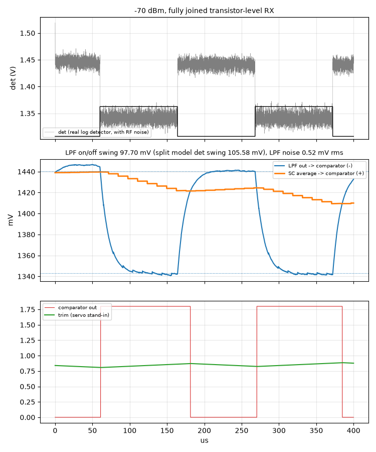

At −94 dBm the signal is buried in noise. Here the real RTL servo drives the real DAC and comparator: the trim code settles and dithers, and the burst is still detected.
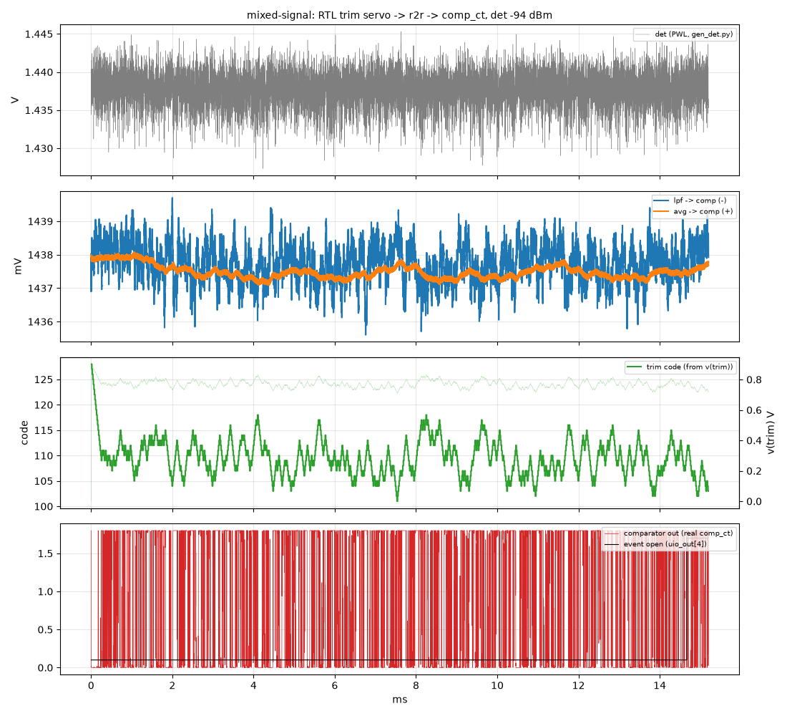

### Support
- [bias_gen](https://xschem-viewer.com/?file=https://github.com/mattvenn/ook-asic-radio/blob/main/xschem/bias_gen.sch): makes the reference currents and the mid-rail voltage for every analog block.
- [dbg_tg](https://xschem-viewer.com/?file=https://github.com/mattvenn/ook-asic-radio/blob/main/xschem/dbg_tg.sch): a switch that connects the detector output to ua[2] in debug mode only.
- [decap_vapwr](https://xschem-viewer.com/?file=https://github.com/mattvenn/ook-asic-radio/blob/main/xschem/decap_vapwr.sch) / [decap_vdpwr](https://xschem-viewer.com/?file=https://github.com/mattvenn/ook-asic-radio/blob/main/xschem/decap_vdpwr.sch): on-chip supply decoupling. It supplies the TX's 433 MHz current spikes locally, so they don't disturb the receiver.

### Digital (`radio_digital` macro)
Verilog is in [`verilog/rtl`](../verilog/rtl), hardened with LibreLane to 200 × 220 µm ([`openlane/radio_digital`](../openlane/radio_digital)).
- **TX:** two LFSRs generate the Gold code, and the TX keys the ring with it three times.
- **RX:** samples the comparator every 13 µs, decides each chip by majority vote (8 samples) at 4 timing offsets, and scores the last 127 chips against its own code. It then runs the 2-of-3 burst check and toggles the LED.
- **Trim servo**, the switched-capacitor clocks, the 7-segment display and the debug/raw modes.
- The RTL and the gate-level netlist both pass the cocotb tests ([`verilog/test`](../verilog/test)), which use vectors from the Python model.

## Layout

Each analog block is generated by a Python script using KLayout and the sky130 parametric cells ([`layout/gen/`](../layout/gen)). Every block goes through:
1. DRC (design rule check: can the fab build it?) and LVS (layout vs schematic: is it the same circuit?).
2. Parasitic extraction: the wires' resistance and capacitance are added back into the netlist.
3. Re-simulation, comparing the extracted block with the schematic.

Per-block previews (TT GDS viewer links) are in [layout/README.md](../layout/README.md). The flow and lessons are in [layout.md](layout.md).

### Floorplan
The tile is 3×2 TT tiles (493 × 226 µm). The digital macro takes the right side. The analog blocks are placed so the signal flows a short way from pin to pin:
- The **RX chain** runs along the bottom, starting at the RX pins ua[0]/ua[1]. It is folded into a U so its output stays far from its own input; feedback from the output to the input would make it oscillate.
- The **TX** sits on the left, above its pins ua[3]/ua[4] and away from the chain's input.
- The signal goes up from the chain: **detector → filter / average → comparator**. The **DAC** and **trim** sit next to the macro's trim outputs.
- The **decaps** fill the gaps.

Block placement, orientation and the nets between them:
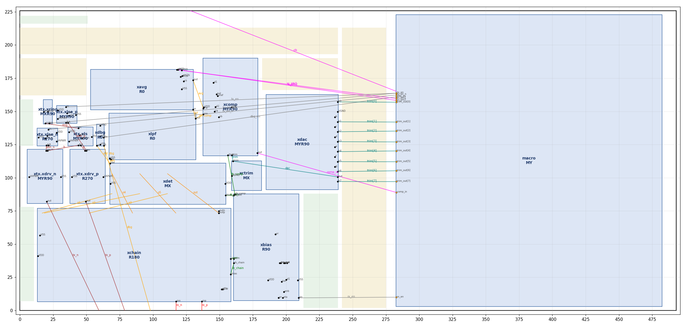

Pin positions and the reasons behind them: [layout/floorplan/pins.md](../layout/floorplan/pins.md) and [floorplan_spec.md](floorplan_spec.md).

### The routed tile
The finished tile is DRC and LVS clean. Power delivery (supply resistance, IR drop, TX→RX coupling) is analysed in [power.md](power.md).
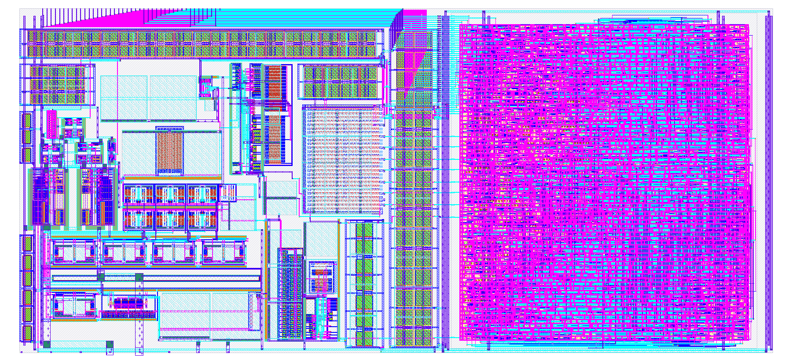

## Further reading
- [PLAN.md](../PLAN.md): every design decision and the evidence behind it.
- [STATUS.md](../STATUS.md): current state and next steps.
- [history.md](history.md): per-block simulation results.
- [sim_learnings.md](sim_learnings.md): xschem / ngspice lessons.
