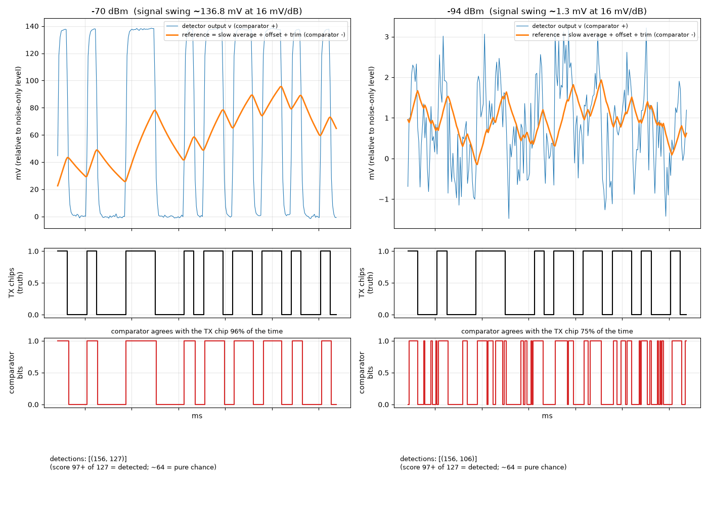

# How the receiver turns a buried signal into chips

## Terms
- **Chip:** one 104 µs time slot of the transmitted on/off pattern (1040 cycles of the 10 MHz clock).
- **Gold code:** a fixed, known pattern of 127 chips selected by the 7-bit DIP code. One pattern is one 13.2 ms burst.
- **Score:** how many of the 127 received chip decisions match the expected pattern. About 64 is pure chance, 127 is perfect, and **≥ 97 is a detection** (6σ above chance).

## The problem
Near the sensitivity limit the wanted signal is weaker than the noise across the LNA's ~400 MHz bandwidth. So "carrier on" lifts the log-detector output by only ~1–4 mV (at an assumed 16 mV/dB), while the detector noise wiggles by about as much.

The comparator's threshold must sit inside that tiny gap and follow it as the level changes by tens of dB with distance.

## The circuit
```
detector ──┬───────────────────────────────► comparator (+)
           └─► slow average (switched-cap RC, τ ≈ 0.5 ms) ──(+)► comparator (−)
                                                             ▲
   8-bit up/down counter ─► R2R DAC ─► attenuate to ±10 mV ──┘
   (+1 when the comparator says 1, −1 when it says 0, once per sample)
```
- **The slow average** sits in the middle of the signal automatically, because the Gold code is half on and half off. It has unlimited range and no steps.
- **The servo** forces the comparator's output to be 1 half the time. That cancels the comparator's own offset (a few mV, which would otherwise push the threshold out of a ~1 mV window) and any small bias. It uses fine steps (~0.08 mV) over a small range.
- Together they act like an ideal threshold at the signal's median, from −50 to −94 dBm.

A full-range 8-bit DAC as the threshold doesn't work: its 7 mV steps can't land inside a 1.3 mV signal.

## What it looks like (model, `model/plot_comparator.py`)


- **−70 dBm:** a 137 mV swing. The comparator agrees with the transmitted chips 96% of the time, giving score 127.
- **−94 dBm:** a 1.3 mV swing buried in noise. The comparator agrees only 75% of the time, but over 127 chips that gives score 106 ≥ 97, so it's **detected**.

The comparator only has to be slightly better than a coin flip; the 127-chip correlation does the rest.

## Overrides
The trim counter can be frozen or set by register (from the RP2350):
- in raw RX mode, e.g. when recording an unbalanced remote-control signal;
- in bring-up, to sweep the trim and measure the comparator offset on silicon.
